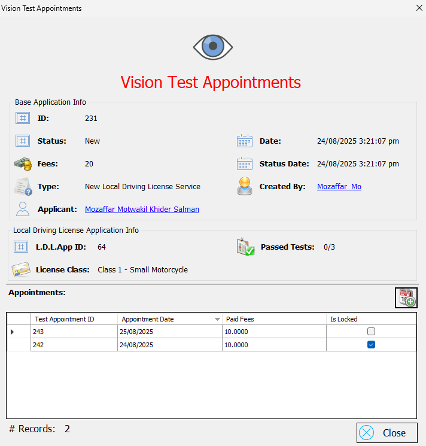

# DVLD System - Driving & Vehicle License Department 🚗

DVLD System is a comprehensive desktop application developed using **Windows Forms** on the **.NET Framework**, designed to manage all operations related to driving and vehicle licensing. The system provides a robust solution for handling user information, license applications, tests, and more, all within an organized and user-friendly interface.

This project was built as part of **Course 19** on the **Programming Advices** platform, under the supervision of **Eng. Mohammed Abu-Hadhood**.

---

## 🧠 Key Features

- **👤 User and People Management**: Full CRUD (Create, Read, Update, Delete) operations for managing person and user information.
- **📝 License Applications**:
  - Process new applications for local driving licenses.
  - Handle new applications for international driving licenses.
- **⏰ Testing & Appointments**:
  - Schedule and manage appointments for vision, written, and street tests.
  - Record test results and manage retake appointments.
- **🪪 License Operations**:
  - Issue and renew local and international licenses.
  - Replace lost or damaged licenses.
  - Detain and release licenses as needed.
- **💻 Interface & Usability**: A clean and intuitive user interface designed for ease of use.

---

## 🛠️ Technologies & Architecture

- **Programming Language**: C#
- **Framework**: .NET Framework 4.7.2
- **Database**: Microsoft SQL Server
- **Data Access**: ADO.NET
- **User Interface**: Windows Forms
- **Architecture**: Three-Tier Architecture for logical separation of concerns, enhancing scalability, maintainability, and code quality. The layers include:
  - **🏢 Presentation Layer (UI)**: Windows Forms interface handling user interaction.
  - **⚙️ Business Logic Layer (BLL)**: Contains all business rules and logic.
  - **🗄️ Data Access Layer (DAL)**: Responsible for all communication with the database.

---

## 📁 Project Structure

- **DVLD.WinForms**: The main executable project containing all the application's forms and user controls (Presentation Layer).
- **DVLD.BusinessLogic**: Contains all the business logic, rules, and operations.
- **DVLD.DataAccess**: Handles interaction with the database.
- **DVLD.Entities**: Contains all the application's models and classes.

---

## 📷 Screenshots

### 🏠 Main Screen


### 👤 People Management


### 👤 User Management


### 📝 Licenses Application Form


### International Licenses 🪪


### ⏳ Tests Scheduling


---

## 🚀 How to Run the Project

1. **Clone the repository:**
   ```bash
   git clone https://github.com/MozaffarMotwakil/driving-and-vehicle-license-department.git
   ```

2. **Restore the database:**
   - Open **SQL Server Management Studio (SSMS)**.
   - Restore the `DVLD.mdf` database file from the `DVLD.DataAccess` folder. Make sure the database name is `DVLD`.
   - Alternatively, attach the database file directly to your local SQL Server instance.

3. **Update the connection string:**
   - Open the project in **Visual Studio**.
   - Navigate to the `App.config` file in the `DVLD.WinForms` project.
   - Update the `connectionString` to match your local SQL Server instance.

4. **Run the application:**
   - Build the solution and run the `DVLD.WinForms` project.

---

## 📬 Contact

For any inquiries or feedback, feel free to contact me.

**Author:** Mozaffar Motwakil

---

🎯 *This project demonstrates the application of OOP principles and clean architecture in a real-world driving and vehicle licensing system.*

